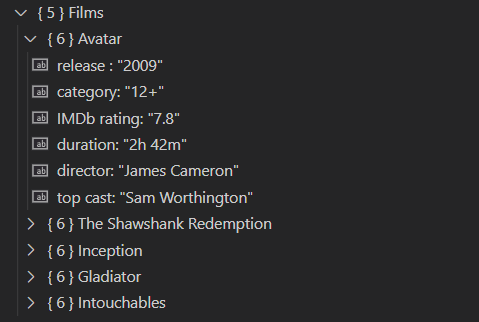

# Задача №1

Проверьте следующий XML на Well formed

## Исходник:
```
<req>

        <surname>Иванов</surname>

        <name>Иван</name>

        <patronymic>Иванович</patronymic>

        <birthdate>01.01.1990</birthdate>

        <birthplace>Москва</birthplace>

        <phone>8 926 766 48 48</phone>

</req
```

## Ошибки
1. В 18й строке нет закрывающего знака ">"


## Результат [Код](work01.xml)
```
<req>

    <surname>Иванов</surname>

    <name>Иван</name>

    <patronymic>Иванович</patronymic>

    <birthdate>01.01.1990</birthdate>

    <birthplace>Москва</birthplace>

    <phone>8 926 766 48 48</phone>

</req>
```
# Задача 2

Проверьте следующий JSON на Well formed

## Исходник:
```
{

        ""surname"": ""Иванов""

        ""name"": ""Иван""

        ""patronymic"": ""Иванович""

        ""birthdate"": ""01.01.1990""

        ""birthplace"": ""Москва""

        ""phone"": ""8 926 766 48 48""

}
```

## Ошибки:
1. Не добавлена общая группа
2. Не проставлены запятые в конце строк
3. Лишние (") в каждой строке

## Результат [Код](work02.json)
```
{
    "main": {
        "surname": "Иванов",
        "name": "Иван",
        "patronymic": "Иванович",
        "birthdate": "01.01.1990",
        "birthplace": "Москва",
        "phone": "8 926 766 48 48"
    }
}
```

# Задача 3

Создайте json файл на основе 5 различных фильмов.

## Результат: [Код](work03.json)


## Отображаться будет вот так:

